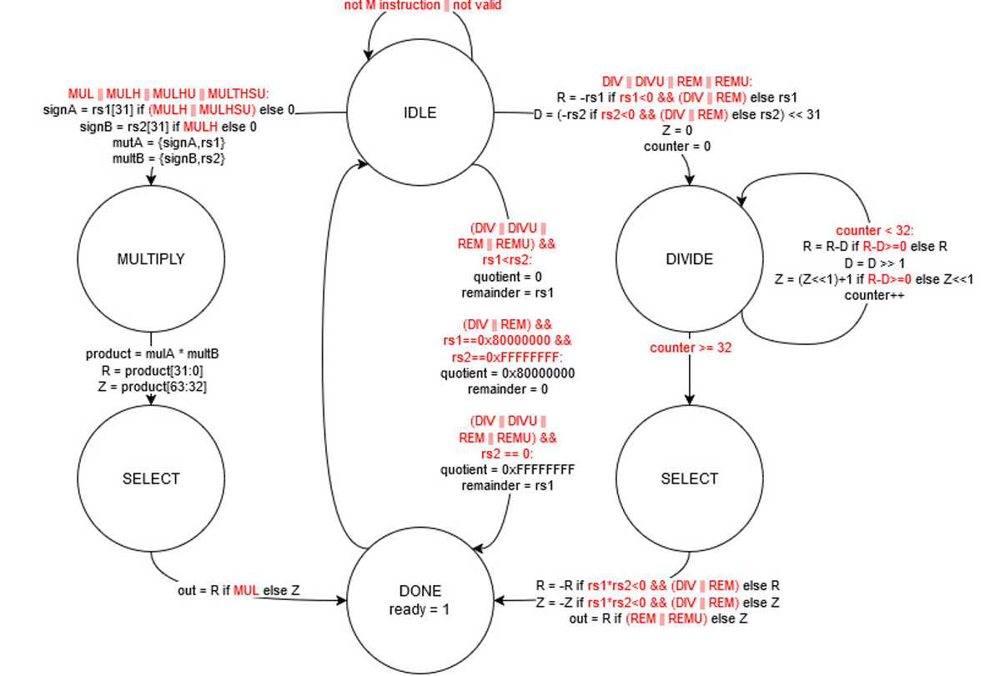
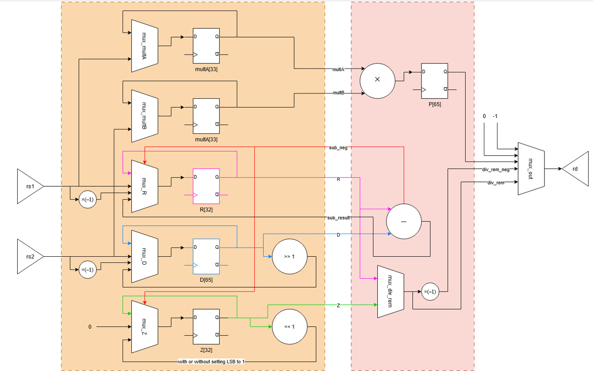

# RISC-V M Extension Co-Processor

Custom Implementation of Multiplication and Division Instructions

## Overview

This project implements the **M extension** of the RISC-V instruction set as a **co-processor** designed to handle multiplication and division operations. The design splits the implementation into two distinct components: a **control path** and a **data path**, each fulfilling a dedicated role in executing the arithmetic instructions.

---

## Architecture

### Signal Interface Description

| Signal   | Direction | Width   | Description                                                                                                                                               |
|----------|-----------|---------|-----------------------------------------------------------------------------------------------------------------------------------------------------------|
| `valid`  | Input     | 1 bit   | Set by the processor when an unknown instruction is discovered. `insn`, `rs1`, and `rs2` are assigned at the same time.                                  |
| `insn`   | Input     | 32 bits | Holds the unknown instruction; assigned simultaneously with `valid`.                                                                                      |
| `rs1`    | Input     | 32 bits | Holds the value of register `rs1` from the instruction `insn`.                                                                                            |
| `rs2`    | Input     | 32 bits | Holds the value of register `rs2` from the instruction `insn`.                                                                                            |
| `ready`  | Output    | 1 bit   | Set by the co-processor to signal that instruction execution is complete and outputs are ready. High for **only one clock cycle**, otherwise causes error. |
| `wr`     | Output    | 1 bit   | Set by the co-processor simultaneously with `ready` if the instruction has a result to return.                                                           |
| `rd`     | Output    | 32 bits | Holds the result value when `wr` is set.                                                                                                                  |
| `busy`   | Output    | 1 bit   | Indicates instruction is being processed. If neither `ready` nor `busy` is high within 16 cycles of `valid`, the processor treats it as illegal.         |

### 🔧 Control Path

The control path is governed by a finite state machine (FSM) with the following states:

* **IDLE**: Waits for the activation signal from the main core.
* **MULTIPLY**: Performs multiplication based on multiplication type.
* **DIVIDE**: Performs division in multiple cycles based on bitwise divison algorithm.
* **SELECT**: Select the correct register to put into output.
* **DONE**: Signals the main core the completion of the multiplication/division.

### 🧮 Data Path

The data path consists of:

* A **register file** for holding operands and results.
* An **ALU** for performing arithmetic operations.
* A control signal `sub_reg` from the ALU to the register file to manage operand routing.

---

## Testbenches

Two testbenches were developed for this project:

1. **Register File Testbench**

   * Tests various multiplexer combinations.
   * Verifies correct register write and read operations.

2. **Co-Processor Testbench**

   * **Multiplication Tests**:

     * Positive × Positive
     * Negative × Positive
     * Maximum possible values (overflow scenarios)
   * **Division & Remainder Tests**:

     * Positive ÷ Positive
     * Negative ÷ Positive
     * Division by zero
     * Dividend < Divisor (Quotient = 0, Remainder = Dividend)
     * Division of minimum negative number by -1 (overflow)

### ⏱️ Cycle Measurements

| Operation Type                      | Cycle Count |
| ----------------------------------- | ----------- |
| Multiplication                      | 4           |
| Division/Remainder (Normal Case)    | 34          |
| Division/Remainder (Exception Case) | 1           |

---

## FPGA Resource Utilization

**Target Board: Nexys A7-100T (Artix-7)**

| Resource        | Utilization |
| --------------- | ----------- |
| DSP Blocks      | 4           |
| Slice LUTs      | 596         |
| Slice Registers | 203         |
| BRAM            | 0           |

---

## Timing Analysis

| Parameter                    | Value    |
| ---------------------------- | -------- |
| **Clock Frequency**          | 100 MHz  |
| **Setup Slack (WNS)**        | 1.088 ns |
| **Hold Slack (WHS)**         | 0.137 ns |
| **Pulse Width Slack (WPWS)** | 4.5 ns   |

---

## License

This project is released under the MIT License.

---
